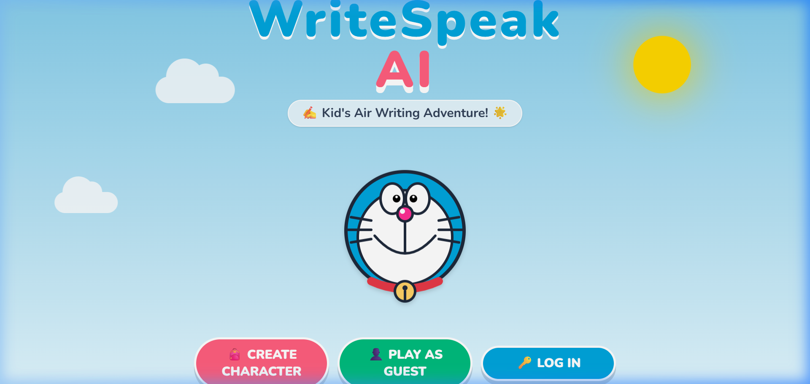
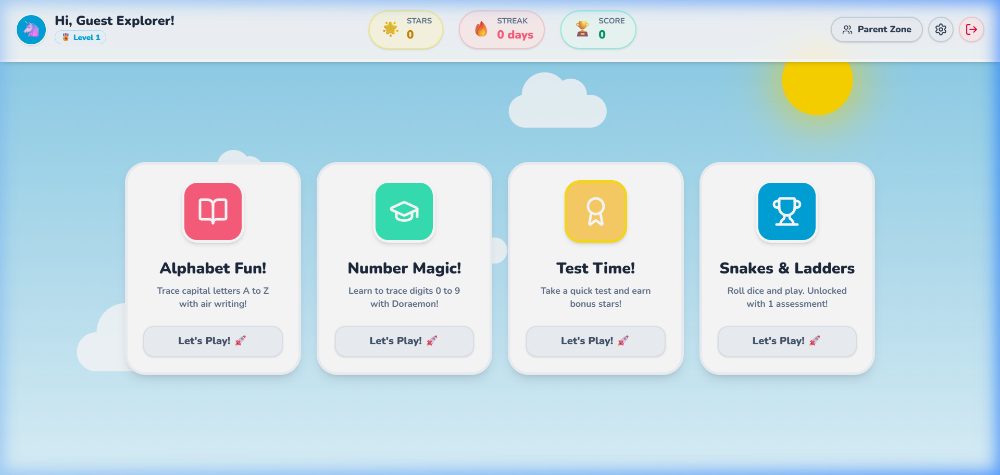

# WriteSpeak AI ✍️ Companion Air Writing Educational Platform

WriteSpeak AI is an interactive, gamified full-stack educational platform designed to teach children alphabets and numbers through real-time air writing, computer vision gesture detection, voice guidelines, and progress rewards!

## 📸 Screenshots

| Welcome Screen (Guest Options) | Learning Dashboard (Guest Mode) |
| :---: | :---: |
|  |  |

---

## 🎨 Core Features

1. **👦 Cute Student Dashboard:**
   - Visual statistics showing collected **Gold Stars** 🌟, **XP Score** 🏆, and **Streaks** 🔥.
   - Interactive badge collection display mapping user milestones.

2. **✋ Hand-Tracking Air Writing Board:**
   - Real-time hand tracking and index-finger contour drawing powered by **MediaPipe Hands**.
   - Custom gesture thresholds (Damping) to handle dropped camera frames.
   - Fallback click-and-drag **Mouse Mode** for offline/webcam-less devices.
   - Dotted guidelines centered inside the drawing box (hidden during tests to assess memory).

3. **📝 Intelligent OCR Assessments:**
   - Real-time client-side OCR evaluation using **Tesseract.js WebAssembly**.
   - Custom matching heuristics (e.g., handles children's messy handwriting, OCR print-style typos).
   - Mock OCR fallback endpoints to prevent kid frustration.

4. **🔊 Voice Guidance & Vocabulary:**
   - Injected kid-friendly Web Speech Synthesis voicing characters, vocabulary phrases, and instructions.
   - Backend `/api/vocabulary` endpoints providing examples and definitions (e.g., "A is for Apple!").

5. **🎲 Snakes & Ladders Board Game:**
   - 10x10 alternating grid board game playable directly against a simulated **Doraemon AI** player.
   - Moves animated with GSAP dice rolls and token sliding.
   - Grants +50 bonus stars upon winning to encourage learning loops.

6. **📊 Parent Performance Portal:**
   - Log summaries of previous quiz assessments.
   - Interactive accuracy trend paths visualized with responsive custom SVG line charts.

---

## 💻 Tech Stack

### Frontend
- **React.js** (Vite SPA)
- **Tailwind CSS v4** & **PostCSS** (CSS-first `@theme` styling configuration)
- **GSAP** (Smooth micro-animations and dice rolling)
- **Tesseract.js** (Client-side WebAssembly OCR engine)
- **MediaPipe Hands** (Hand gesture landmark coordinates tracking)

### Backend
- **Java Spring Boot** (JDK 25 compatibility with lombok `-proc:full`)
- **Spring Security** & **JWT Auth** (Bearer authorization token headers validation)
- **Spring Data MongoDB** (Persisting user progress logs and test history results)
- **FuzzyWuzzy** (Fuzzy matching algorithms for spoken voice checks)

---

## 📁 Workspace Directory Structure

```
writespeak-ai/
├── README.md               # Root project documentation
├── backend/                # Java Spring Boot Service
│   ├── pom.xml             # Maven dependencies configuration
│   └── src/main/java       # Source classes (Controllers, Services, Models, Configs)
├── frontend/               # React + Tailwind + GSAP SPA Client
│   ├── index.html          # CDN script loads for MediaPipe
│   ├── src/                # Components, context state providers, and custom hooks
│   └── package.json        # Dependencies (Tesseract, GSAP, Lucide)
└── maven_temp/             # Local offline Maven binary (apache-maven-3.9.16)
```

---

## 🚀 Step-by-Step Launch Instructions

Ensure a MongoDB instance is running locally or specify your custom MongoDB Atlas cluster connection string.

### Step 1: Start the Spring Boot Backend
From the root workspace directory, run:
```powershell
cd backend
# Run using the workspace local Maven binary:
..\maven_temp\apache-maven-3.9.16\bin\mvn.cmd spring-boot:run
```
*Note: If using MongoDB Atlas, export your connection string first:*
*   **PowerShell:** `$env:SPRING_DATA_MONGODB_URI="your-atlas-uri"`
*   **CMD:** `set SPRING_DATA_MONGODB_URI=your-atlas-uri`

### Step 2: Start the Frontend Client
From the root workspace directory, run:
```powershell
cd frontend
npm run dev
```
Open [http://localhost:5173/](http://localhost:5173/) in your web browser and start tracing! 🚀
