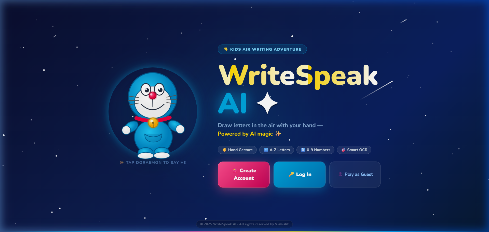
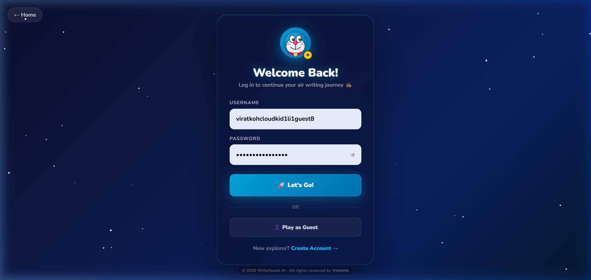
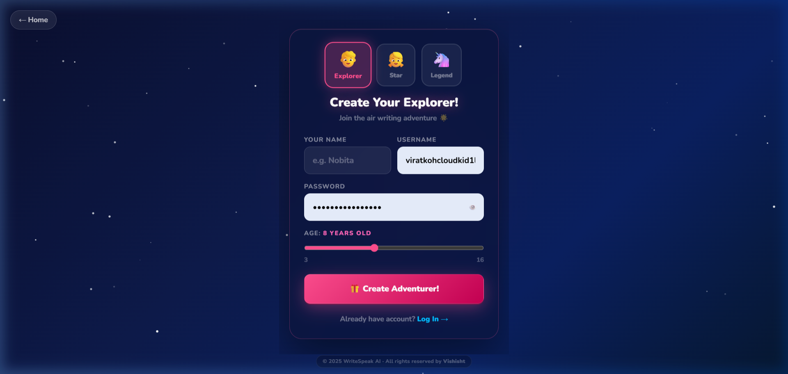
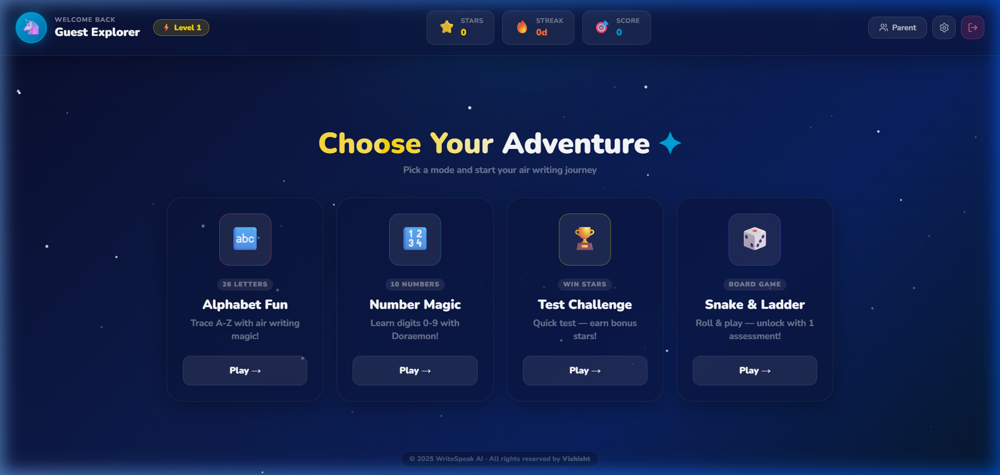
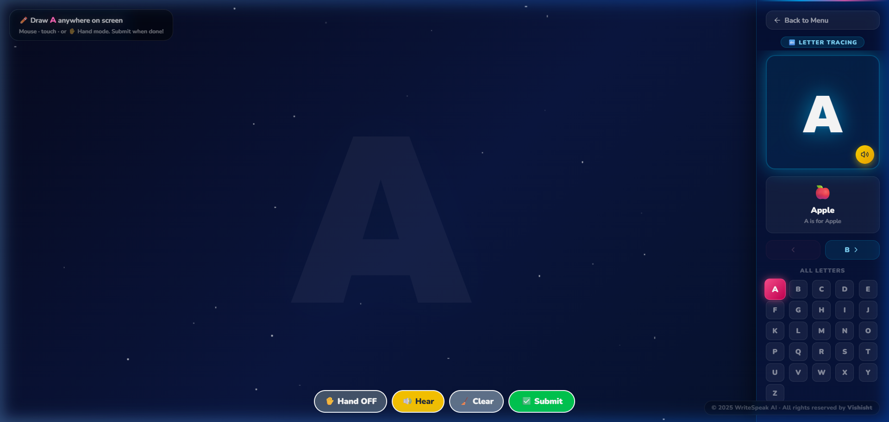
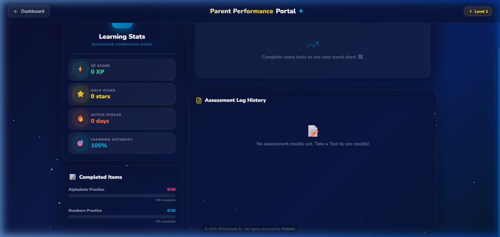
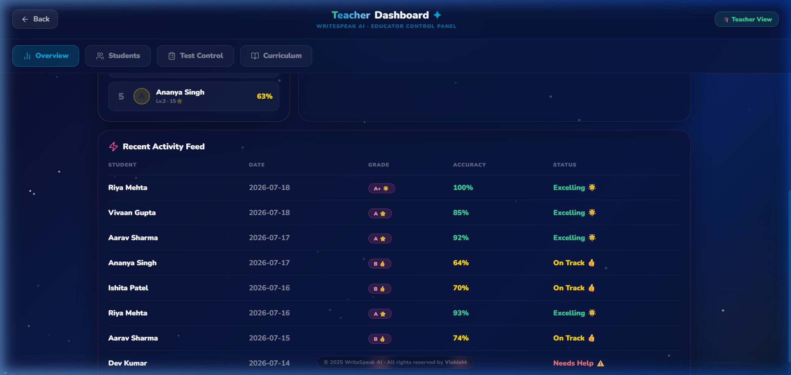

# ✨ WriteSpeak AI — Kids Air Writing Adventure

> **Draw letters & numbers in the air with your hand — powered by AI & Computer Vision!**
>
> © 2025 WriteSpeak AI · All rights reserved by **Vishisht**

---

## 📸 App Screenshots

### 🏠 Welcome Page


### 🔑 Login Page


### 🎒 Sign Up Page


### 🎮 Dashboard (Mode Selection)


### ✍️ Learning Mode (Working Area)


### 👨‍👩‍👦 Parent Performance Portal


### 🎓 Teacher Dashboard — Educator Control Panel



---

## 🚀 Features

| Feature | Description |
|---|---|
| ✋ Hand Gesture Drawing | MediaPipe-powered real-time hand tracking with Kalman filter smoothing |
| 🔤 Alphabet Learning | Trace A–Z in the air with ghost letter guide |
| 🔢 Number Learning | Trace 0–9 with Doraemon vocabulary hints |
| 🏆 Test Mode | Quick assessment with XP & star rewards |
| 🎲 Snake & Ladder | Board game unlocked after first assessment |
| 🧠 Smart OCR | 3-layer pipeline: Backend API → Template Match (Top-3) → Tesseract |
| 📊 Parent Dashboard | Performance trend chart, accuracy stats, history log |
| 🎓 Teacher Dashboard | Educator control panel — student overview, test config, curriculum control |
| 🔐 Offline Auth | Works offline — localStorage fallback when backend unreachable |
| ✨ Royal UI | Royal dark Doraemon night-sky theme across all pages |

---

## 🛠️ Tech Stack

### Frontend
- **React 18** + Vite
- **TailwindCSS** for utility classes
- **MediaPipe Hands** — hand landmark detection
- **Tesseract.js** — client-side OCR fallback
- **canvas-confetti** — celebration animations
- **lucide-react** — icons

### Backend
- **Java 17** + **Spring Boot 3**
- **Spring Security** + JWT authentication
- **MongoDB** — user data, progress, test results
- **Custom OCR Service** — primary letter recognition endpoint

---

## 🖥️ Local Setup

### Prerequisites
- Node.js 18+
- Java 17+
- MongoDB running locally

### Frontend
```bash
cd frontend
npm install
npm run dev
# Opens at http://localhost:5173
```

### Backend
```bash
cd backend
./mvnw spring-boot:run
# API at http://localhost:8080
```

> **Note:** The app works fully offline — if the backend is not running, authentication uses a localStorage fallback automatically.

---

## 📁 Project Structure

```
project/
├── frontend/
│   └── src/
│       ├── components/
│       │   ├── WelcomeScreen.jsx     # Royal landing page with Doraemon
│       │   ├── LoginPage.jsx         # Royal login with glassmorphism card
│       │   ├── SignupPage.jsx        # Royal signup with avatar selector
│       │   ├── ModeSelection.jsx     # Royal dashboard with hover-glow cards
│       │   ├── LearningMode.jsx      # Drawing canvas + royal right panel
│       │   ├── DrawingCanvas.jsx     # MediaPipe + Kalman + Bezier curves
│       │   ├── ParentDashboard.jsx   # Performance portal with trend chart
│       │   ├── TeacherDashboard.jsx  # Educator control panel (students, tests, curriculum)
│       │   ├── TestMode.jsx          # Assessment mode
│       │   ├── SnakeLadderGame.jsx   # Board game
│       │   └── Copyright.jsx        # © Vishisht footer badge
│       ├── context/
│       │   ├── AuthContext.jsx       # JWT auth + localStorage
│       │   └── SettingsContext.jsx
│       ├── hooks/
│       │   └── useProgress.js
│       └── utils/
│           └── api.js               # Offline-first auth API
└── backend/
    └── src/main/java/com/writespeak/
        ├── controller/              # REST endpoints
        ├── service/                 # Business logic + OCR
        ├── model/                   # MongoDB models
        └── config/                  # Security + JWT + CORS
```

---

## 🎨 Design System

| Token | Value | Usage |
|---|---|---|
| `#0a0e2e` | Deep Navy | Page backgrounds |
| `#00A5DC` | Doraemon Blue | Primary accent, glows |
| `#FF4E8E` | Doraemon Pink | Secondary accent, CTA |
| `#FFD700` | Royal Gold | Title shimmer, stars |
| `#7C3AED` | Royal Purple | Game card |
| Glassmorphism | `backdrop-blur-xl` | All cards/panels |

---

## 🤖 OCR Pipeline

```
User draws letter
       ↓
1. Backend API (localhost:8080) — primary recognition
       ↓ (if offline or fails)
2. Template Match — NCC pixel similarity against all 36 chars
   → Top-3 ranking check (target must rank in top 3)
       ↓ (if still uncertain)
3. Tesseract.js — 40% confidence threshold, PSM 8/7/10
       ↓
Result: ✅ Correct / ❌ Try Again
```

---

## ✋ Hand Gesture Controls

| Gesture | Action |
|---|---|
| ☝️ Index finger up | Draw mode — tracks fingertip |
| ✊ Fist (hold 1s) | Submit drawing for OCR |
| 🖐️ Open palm (hold 1s) | Clear canvas |

**Smoothing:** Kalman 1D filter (R=0.12, Q=0.6) + Catmull-Rom Bezier curves for fluid strokes.

---

## 📄 License

© 2025 WriteSpeak AI — All rights reserved by **Vishisht**.
