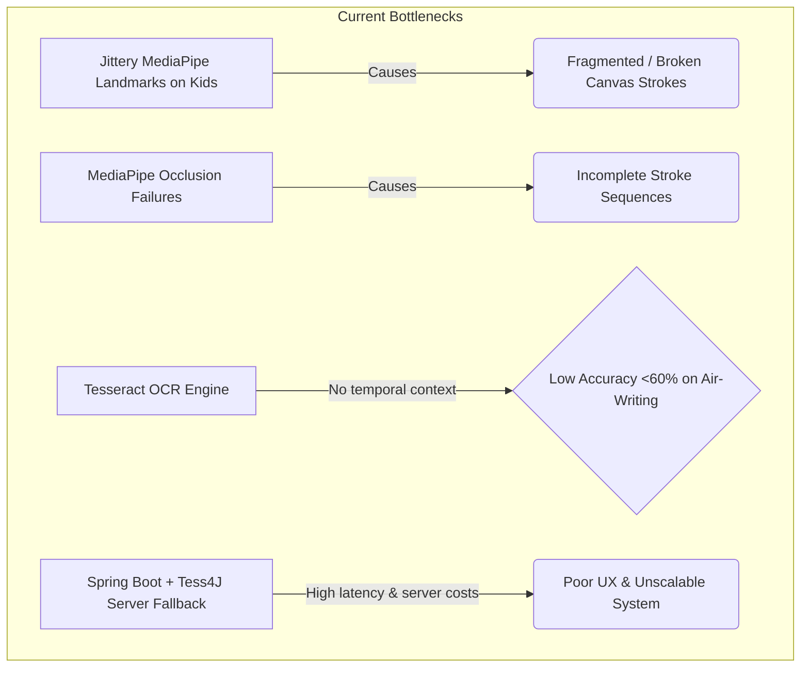
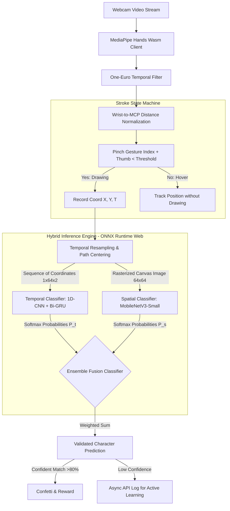
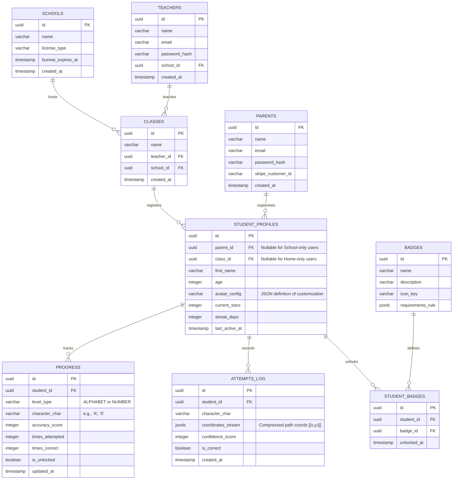
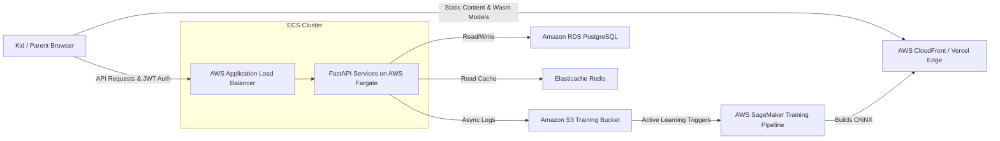
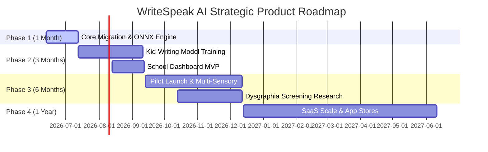

# WriteSpeak AI: Production-Ready System Architecture & Product Roadmap

This document outlines the professional system architecture, AI/ML pipelines, database design, API structures, deployment strategies, and business-focused roadmap to transform **WriteSpeak AI** from a prototype into a production-ready, scalable EdTech SaaS platform tailored for children aged 3–8.

---

## 1. Architectural Bottlenecks & Critical Weaknesses

Our analysis of the current prototype reveals five critical bottlenecks that impede accuracy, stability, and scale:



### 1.1. MediaPipe Instability for Children
* **The Root Cause:** MediaPipe's hand tracking model is trained primarily on adult hands. Children (ages 3–8) have smaller hands, shorter fingers, different aspect ratios, and lower skin reflectivity/contrast. This causes high landmark jitter and false hand-loss detection.
* **The Impact:** Jittery strokes, drawing discontinuities, and frustrating gameplay loops.

### 1.2. Finger Occlusion during Rotation
* **The Root Cause:** When writing letters like "S" or "O", the child's index finger often rotates away from the camera or is occluded by the palm or knuckles. MediaPipe loses track of the index finger landmark (`INDEX_FINGER_TIP`) and jumps to the nearest visible finger or disappears.
* **The Impact:** Gaps in character strokes that ruin static image OCR.

### 1.3. Tesseract OCR Limitations on Isolated Air-Writing
* **The Root Cause:** Tesseract is designed for offline, high-contrast, multi-word document text with layout boundaries. It lacks temporal awareness (how the character was drawn over time) and expects sharp, anti-aliased font structures. Noise, varied thickness, and irregular gaps from air-writing cause it to fail.
* **The Impact:** Highly inconsistent letter recognition (often $<60\%$ accuracy for children).

### 1.4. In-Browser vs. Server-Side Execution Bottlenecks
* **The Root Cause:** Tesseract.js is heavy, requiring WebAssembly downloads (~15MB+) and heavy CPU usage, leading to dropped frames on budget Chromebooks or low-end iPads commonly used in classrooms. Moving inference to the backend (Spring Boot + Tess4J) introduces round-trip latencies of 1–2 seconds, breaking real-time feedback loops.

---

## 2. Recommended AI/ML & Computer Vision Pipeline

To achieve $>95\%$ recognition accuracy and robust hand tracking, we propose replacing Tesseract with a **Hybrid Spatial-Temporal Classifier** and applying advanced digital signal processing (DSP) to hand landmarks.



### 2.1. Hand Tracking: MediaPipe Optimization & Landmark Normalization
Instead of swapping out MediaPipe completely (which would lose standard browser support), we optimize it using client-side pre-processing:
1. **Dynamic Scaling (Age-Agnostic):** Kids have smaller hands. We normalize all 2D landmark coordinates $(x_i, y_i)$ relative to the distance between the **Wrist** (`WRIST`, index 0) and the **Middle Finger MCP** (`MIDDLE_FINGER_MCP`, index 9).
   $$d_{norm} = \sqrt{(x_9 - x_0)^2 + (y_9 - y_0)^2}$$
   $$x_{scaled} = \frac{x_i - x_0}{d_{norm}}, \quad y_{scaled} = \frac{y_i - y_0}{d_{norm}}$$
2. **One-Euro Filter:** To eliminate jitter without introducing lag, we replace basic moving averages with a **One-Euro Filter**—an adaptive low-pass filter. It applies heavy filtering at low speeds (reducing static jitter) and low filtering at high speeds (preventing lag).
3. **Pinch-to-Draw Gesture:** Replace the single "Index Finger Up" with a "Pinch" gesture (Index Tip meets Thumb Tip). This gives the child a physical sensation of "holding a pen," which dramatically reduces finger occlusion and accidental drawing compared to just hovering.

### 2.2. The AI Classifier: Replacing OCR with a Spatial-Temporal Ensemble
Air-writing is inherently a **time-series coordinate dataset** (Online Handwriting) rather than a **static image** (Offline Handwriting). We deploy a hybrid model inside the browser via **ONNX Runtime Web**:

| Model Component | Architecture | Input Data | Strengths |
| :--- | :--- | :--- | :--- |
| **Temporal Model** | 1D-CNN + Bidirectional GRU (or lightweight LSTM) | Sequence of $N$ normalized coordinates: $[(x_1, y_1), \dots, (x_{64}, y_{64})]$ | Learns the order and direction of strokes. Completely immune to visual noise, background artifacts, and canvas thickness. |
| **Spatial Model** | MobileNetV3-Small (2D CNN) | $64 \times 64$ grayscale rasterized stroke canvas image. | Excellent at verifying final shapes and static proportions. Runs in $<10\text{ ms}$ on mobile/web. |

**Ensemble Fusion:**
$$\text{Probability}(Class) = \alpha \cdot P_{temporal} + (1 - \alpha) \cdot P_{spatial} \quad (\text{where } \alpha \approx 0.65)$$

---

## 3. Database Design (PostgreSQL)

To scale from a simple student app to an enterprise-ready EdTech platform, we design a multi-tenant PostgreSQL schema supporting **Schools**, **Classes**, **Teachers**, **Parents**, and **Children Profiles** with robust indexing.



### 3.1. DB Performance Optimization & Indexes
* **Partial Index for Active Streaks:** To optimize daily dashboards.
  ```sql
  CREATE INDEX idx_active_students ON student_profiles (streak_days) WHERE streak_days > 0;
  ```
* **Composite Index for Progress Queries:**
  ```sql
  CREATE INDEX idx_student_progress ON progress (student_id, level_type, character_char);
  ```
* **Attempts JSONB Compression:** Stroke data streams (`coordinates_stream`) are saved as compressed float arrays inside a `jsonb` field to prevent excessive row sizes and disk bloat while retaining structural coordinates for future AI training.

---

## 4. RESTful API Structure (FastAPI)

FastAPI acts as the high-throughput gateway. We define a clean API structure with schema structures, routing, token-based authentication (JWT), and support for client telemetry.

### 4.1. Core Endpoints Table

| Method | Endpoint | Auth | Request Body | Description |
| :--- | :--- | :--- | :--- | :--- |
| `POST` | `/api/v1/auth/signup` | None | `{email, password, name, type: "parent"\|"teacher"}` | Register new adult user. |
| `POST` | `/api/v1/auth/login` | None | `{email, password}` | Returns JWT Access & Refresh token. |
| `POST` | `/api/v1/students` | JWT | `{first_name, age, parent_id, class_id}` | Create student profile. |
| `GET` | `/api/v1/students/{id}/dashboard` | JWT | None | Get dashboard stats (stars, badges, history). |
| `POST` | `/api/v1/attempts` | JWT | `{student_id, character, duration_ms, points: [[x,y,t]], is_correct}` | Log air-writing attempt & coordinates. |
| `GET` | `/api/v1/teachers/analytics` | JWT | Query params: `class_id`, `date_range` | Aggregated class performance metrics. |
| `POST` | `/api/v1/ai/validate-stroke` | None | `{character, points: [[x,y,t]]}` | Backend validation fallback (for legacy browser testing). |

### 4.2. Sample Request & Response Payloads

#### POST `/api/v1/attempts` (Register writing attempt)
* **Request:**
```json
{
  "student_id": "8f89c67a-1152-4416-8968-3e4b78c9354d",
  "character": "A",
  "duration_ms": 3200,
  "points": [
    [0.12, 0.45, 100],
    [0.15, 0.40, 150],
    [0.18, 0.35, 200],
    [0.21, 0.42, 250]
  ],
  "is_correct": true
}
```

* **Response (HTTP 201 Created):**
```json
{
  "attempt_id": "c1f7a075-8025-4c07-88d4-5ee8568c07e8",
  "stars_earned": 3,
  "new_streak": 5,
  "badges_unlocked": [
    {
      "badge_id": "d2f6b899-4a94-4f81-9b16-562a22be783c",
      "name": "Super Writer",
      "icon_key": "badge_super_writer"
    }
  ]
}
```

#### GET `/api/v1/teachers/analytics` (Classroom Level Analysis)
* **Response (HTTP 200 OK):**
```json
{
  "class_id": "2ea1ab90-fc5d-4f18-a6e5-47f68c4a5202",
  "metrics": {
    "total_students": 25,
    "average_accuracy": 84.5,
    "weakest_characters": ["S", "8", "Z"],
    "strongest_characters": ["I", "1", "0"],
    "active_streak_count": 18
  },
  "student_summaries": [
    {
      "student_id": "8f89c67a-1152-4416-8968-3e4b78c9354d",
      "first_name": "Leo",
      "accuracy": 92.1,
      "levels_completed": 12,
      "last_active": "2026-06-12T18:45:00Z"
    }
  ]
}
```

---

## 5. Deployment Strategy

The deployment model leverages edge distribution for fast client-side loading, serverless auto-scaling for the FastAPI business logic, and telemetry pipelines for real-time monitoring.



### 5.1. Target Infrastructures
* **Frontend Delivery:** Vercel Edge Network or AWS CloudFront CDN. Models (`.onnx` binaries) are statically hosted with HTTP caching headers (`Cache-Control: public, max-age=31536000, immutable`) to avoid redownloads.
* **Backend Processing:** Dockerized FastAPI running on **AWS ECS Fargate** (Serverless Containers). Scale dynamically based on CPU/Request count (coinciding with school hours).
* **Database Management:** **Amazon RDS PostgreSQL** with Multi-AZ replication.
* **Telemetry & Monitoring:** **Prometheus** + **Grafana** (API performance, response latency) and **Sentry** (for tracking browser-side WebAssembly failures).

### 5.2. Active Learning Cycle & Continuous AI Delivery
To continuously improve model accuracy on kids' handwriting styles without manual intervention:
1. When a client performs drawing evaluations, coordinates are securely logged to the PostgreSQL backend asynchronously.
2. Low-confidence classification logs ($60\% - 80\%$) are periodically written to a secure **AWS S3 bucket**.
3. Every month, a serverless script runs to clean and generate new training datasets.
4. **AWS SageMaker** fine-tunes the MobileNetV3 and Bi-GRU models, exports them to ONNX format, and pushes them to the production CDN via a Github Actions CI/CD release pipeline.

---

## 6. Premium Gamification & Educational Features

To elevate the app from a tool to an engaging learning adventure, we enhance the reward system and introduce tailored interfaces for classrooms and homes.

### 6.1. B2C: Interactive Reward System (Parents & Children)
* **Customizable Avatar Companions:** Children earn stars to buy hats, glasses, and color themes for their Doraemon (or custom animal) companion.
* **Multi-Sensory Audio System:** Voice acting guides the student, calling them by name (TTS), providing sound effects for correct strokes, and offering positive encouragement ("Good try! Draw it from top to bottom this time!").
* **Physical Certificate Generator:** Upon mastering a full tier (e.g., lowercase alphabets), parents can download a custom, colorful completion certificate to print out, reinforcing digital progress with tangible rewards.

### 6.2. B2B: School & Classroom Management Suite (Teachers & Admins)
* **Guided Classroom Testing Mode:** Teachers can push an "Active Assignment" to all student tablets simultaneously (e.g., "Write the letter M").
* **Dysgraphia & Handwriting Deficit Risk Screeners:** By analyzing time-series coordinates ($x, y, t$), the AI measures speed variations, tremor lines, and stroke sequences. While not a clinical diagnosis, the system alerts teachers if a student displays consistent motor control anomalies for early screening.
* **Offline-First School Integration:** Schools often suffer from poor Wi-Fi. We implement a local Service Worker cache. Students can complete assignments fully offline; progress and stroke coordinates are queued in IndexedDB and synchronized once the device regains connection.

---

## 7. Future Strategic Roadmap

The transition plan is divided into four distinct phases over a one-year window:



### 7.1. Month 1: Core Foundation & High-Performance ONNX Engine
* **Action Items:**
  * Migrate the Spring Boot backend to FastAPI. Add schema boundaries and JWT-based authentication.
  * Integrate ONNX Runtime Web (`ort-web`) inside the React Vite frontend.
  * Implement One-Euro Filtering and wrist-normalized landmarks inside the canvas.
  * Replace Tesseract.js client-side with a base-model MobileNetV3 + Bi-GRU running on ONNX.
* **Milestone:** Stable, zero-latency local character recognition ($>85\%$ accuracy on adult hands/stable drawings).

### 7.2. Month 3: Kids-Specific Model Training & School Dashboard MVP
* **Action Items:**
  * Establish a data capture pipeline (using an internal tool) to collect $10,000$ air-writing samples from children aged 3–8.
  * Train and fine-tune the spatial-temporal model on this dataset to handle children's hand proportions.
  * Build the PostgreSQL multi-tenant structure and launch the MVP of the Teacher Analytics Dashboard.
  * Introduce offline sync queuing via IndexedDB.
* **Milestone:** Recognition accuracy climbs to $>92\%$ for children. Fully functional school management dashboard.

### 7.3. Month 6: Pilot Deployments & Multimodal Learning Expansion
* **Action Items:**
  * Roll out pilot trials across 10 partner preschools/kindergartens.
  * Integrate real-time voice synthesis and interactive, context-aware instructions.
  * Develop the dysgraphia screening engine, establishing baselines for writing velocity and coordinate deviation.
  * Implement parental subscription models (Stripe gateway integration for B2C premium tiers).
* **Milestone:** 1,000+ daily active users (DAUs), first cohort of school feedback.

### 7.4. Year 1: Startup Scale & Cross-Platform Launch
* **Action Items:**
  * Package the React application using Capacitor / Tauri to release native applications for Apple App Store (iPads), Google Play Store (Android tablets), and Chromebooks.
  * Launch active marketing campaigns for schools (B2B SaaS) and parent-facing channels (B2C).
  * Expand the AI models to support cursive writing, word tracing, and non-English scripts.
  * Obtain formal certification / validation as an educational supplementary resource.
* **Milestone:** 50,000+ users, certified EdTech platform, venture-ready metrics.
